# 🚀 Navik Voiceover — System Workflow & Technical Architecture (Under The Hood)

An in-depth technical documentation of how the **Navik Voiceover AI Engine** operates under the hood to transform silent pitch deck recordings and presentation videos into human-narrated executive videos.

---

## 📌 Executive Overview

The primary objective of **Navik Voiceover** is to eliminate manual pitch deck explanations. The platform processes screen-capture videos of presentation slides (Google Slides, Pitch.com, PDF, PPT walkthroughs) and automatically:
1. **Analyzes visual content & extracts text** from every slide frame with high precision.
2. **Synthesizes executive-level presentation dialogue** (1 to 2 natural sentences per slide).
3. **Generates hyper-realistic human voiceover speech** using **Voicebox (Kokoro-82M Neural Engine)**.
4. **Synchronizes audio to slide boundaries** so speech finishes before slide transitions, with total audio duration matching video length to the millisecond.
5. **Renders the final composited MP4** with burned-in transcript subtitles.

---

## 🏗️ System Architecture & Workflow Diagram

```mermaid
flowchart TD
    A[User Uploads Presentation Video .mp4 / .mov] --> B[FastAPI Upload Endpoint /api/upload]
    B --> C[Phase 1: VideoScriptGenerator backend/browser_agent.py]
    
    subgraph Phase 1: Video Analysis & OCR
        C --> C1[cv2.VideoCapture Metadata Probing]
        C1 --> C2[Dynamic Keyframe & Scene Extraction]
        C2 --> C3[EasyOCR CRAFT + CRNN Deep Text Recognition]
        C3 --> C4[Deck Header Frequency Filtering - Isolates Unique Slide Title]
        C4 --> C5[Groq Llama-3.3 / Gemini Vision / Local OCR Script Synthesizer]
    end
    
    C5 --> D[1-2 Sentence Slide Narration Script Cards]
    D --> E[Phase 2: VoiceoverGenerator backend/tts_engine.py]
    
    subgraph Phase 2: Voicebox Kokoro Synthesis & Audio Alignment
        E --> E1[Voice Character Lock - Kokoro-82M Local ONNX Engine]
        E1 --> E2[Rhythmic Speech Pacing at 0.92x Speed]
        E2 --> E3[FFmpeg atempo Scaling if Narration > Slide Time]
        E3 --> E4[FFmpeg apad Silence Padding - Caps Speech Gap to Max 1.5s]
        E4 --> E5[Audio Track Match to Total Video Duration]
    end
    
    E5 --> F[Combined Voiceover Track .mp3]
    F --> G[Phase 3: VideoStitcher backend/video_stitcher.py]
    
    subgraph Phase 3: Video Compositing & Subtitles
        G --> G1[SRT Subtitle Generation with Timestamps]
        G1 --> G2[FFmpeg H.264 Video + AAC Audio Stitching]
        G2 --> G3[Burned-in Transcript Subtitle Overlay Pills]
    end
    
    G3 --> H[Final Narrated Executive Presentation MP4]
```



---

## ⚙️ Detailed Step-by-Step Technical Execution

### Stage 1: Video Metadata Probing & Frame Segmentation
* **Module**: [`backend/browser_agent.py`](file:///e:/NAVIK%20TASK/backend/browser_agent.py) -> `VideoScriptGenerator.extract_keyframes()`
* **Mechanism**:
  - Uses `cv2.VideoCapture` to probe total duration ($D$), framerate (FPS), resolution ($W \times H$), and frame count.
  - Dynamically calculates the number of segments ($N = \text{clamp}(3, \text{duration} / 10, 30)$) to ensure complete timeline coverage (`0.0s` to `duration`).
  - Saves high-resolution keyframe images (`frame_00_0s.jpg`, `frame_01_6s.jpg`, etc.) into `uploads/extracted_frames`.

### Stage 2: Deep OCR Text Extraction & Deck Title Filtering
* **Module**: [`backend/browser_agent.py`](file:///e:/NAVIK%20TASK/backend/browser_agent.py) -> `extract_text_from_frame()` & `generate_local_ocr_script()`
* **Mechanism**:
  - **EasyOCR Engine (CRAFT + CRNN)**: Reads slide headers, subheaders, bullet points, numbers ($4.2B), percentages (22%), founder names, and raising stages.
  - **OpenCV Contrast Preprocessing**: Applies grayscale thresholding and adaptive binarization for dark and light background slides.
  - **Header Frequency Filtering**: Analyzes recurring words across all frames (e.g. `PITCH DECK`, `NAVIK LABS`, `CONFIDENTIAL`). Filters out repeated deck headers to isolate the **unique slide title** for every scene.

### Stage 3: Deep AI Context Analysis & Executive Script Generation
* **Module**: [`backend/browser_agent.py`](file:///e:/NAVIK%20TASK/backend/browser_agent.py) -> `analyze_frames_with_llm()`
* **Mechanism**:
  - **Word Budget Calculation**: For each slide segment of duration $T$, calculates maximum allowed words:
    $$\text{max\_words} = \text{max}(6, \lfloor T \times 2.2 \rfloor)$$
    This matches natural human presenter speed (~135 words per minute).
  - **LLM Synthesizers**:
    - **Groq LLM (`llama-3.3-70b-versatile`)**: Sub-second context processing.
    - **Gemini 2.0 Flash Vision**: Multimodal vision analysis.
    - **Local OCR Narrator**: Rule-assisted offline narrative builder.
  - **Executive Presenter Dialogue Rules**: Eliminates robotic template fillers (*"Welcome to..."*, *"Next we look at..."*). Produces direct, natural founder dialogue explaining the slide's business content.

### Stage 4: Voicebox (Kokoro-82M) Synthesis & Timeline Audio Sync
* **Module**: [`backend/tts_engine.py`](file:///e:/NAVIK%20TASK/backend/tts_engine.py) -> `EdgeTTSEngine`
* **Mechanism**:
  - **Voicebox (Kokoro-82M ONNX)**: Runs local neural TTS via `kokoro_onnx` using `kokoro-v1.0.onnx` and `voices-v1.0.bin`.
  - **Strict Voice Character Locking**: Ensures 100% of all slide segments use the exact selected speaker (`am_adam`, `af_heart`, `af_bella`, `am_michael`, `bf_emma`) without mid-presentation voice switches.
  - **Presenter Pacing**: Synthesizes speech at a calm, slow presenter pace (`0.92x` speed).
  - **FFmpeg `atempo` Scaling**: If a narration segment exceeds its slide duration, speeds up audio so speech finishes **0.15s before** slide transition.
  - **FFmpeg `apad` Silence Padding**: If a narration segment is shorter than its slide duration, pads trailing silence up to a **maximum of 1.2s to 1.5s**, guaranteeing the delay between two speeches **NEVER exceeds 2 seconds**.
  - **Full Video Length Match**: Pads final audio track so total audio duration matches total video duration down to the millisecond.

### Stage 5: Subtitle Generation & Final Video Compositing
* **Module**: [`backend/video_stitcher.py`](file:///e:/NAVIK%20TASK/backend/video_stitcher.py) -> `VideoStitcher.combine_video()`
* **Mechanism**:
  - Generates timed `.srt` subtitle files with segment start/end timestamps.
  - Executes FFmpeg H.264 video rendering with burned-in semi-transparent subtitle pills (`PrimaryColour=&H00FFFFFF`, `BackColour=&H80000000`).
  - Merges original video track with synthesized Voicebox audio track into final MP4.

---

## 📁 Codebase Directory Structure & Responsibilities

```
e:\NAVIK TASK
├── backend/
│   ├── main.py                # FastAPI REST server endpoints & CORS routing
│   ├── browser_agent.py       # Keyframe extraction, EasyOCR & AI Script Generator
│   ├── tts_engine.py          # Voicebox (Kokoro-82M) ONNX, voice locking & silence padding
│   ├── voice_generator.py     # Voice synthesis orchestration & voice catalog
│   ├── video_stitcher.py      # Subtitle generation & FFmpeg video compositing
│   ├── audio_analyzer.py      # Audio probing & SpeechRecognition fallback
│   └── credentials_manager.py # Machine-key encrypted storage for API keys
├── frontend/
│   ├── index.html             # Responsive dark-mode single-page application UI
│   ├── app.js                 # Event handlers, API fetchers & editable script table
│   └── index.css              # Custom CSS design system with glassmorphism
├── uploads/                   # Temporary directory for uploaded user videos & frames
├── output/                    # Generated audio files, SRT subtitles, and final MP4 videos
├── samples/                   # Pre-loaded pitch deck sample videos
├── requirements.txt           # Python dependencies manifest
└── SYSTEM_WORKFLOW_UNDER_THE_HOOD.md # Technical workflow documentation
```

---

## 🛠️ Technology Stack Summary

| Layer | Component / Technology | Role in System |
| :--- | :--- | :--- |
| **Frontend** | HTML5 / Vanilla CSS / JavaScript | Interactive Web UI with video player, voice selector & editable script cards. |
| **API Server** | FastAPI / Uvicorn | Async Python backend server running at `http://127.0.0.1:8000`. |
| **Computer Vision** | OpenCV (`cv2`) & PySceneDetect | Video metadata probing, frame decoding, and scene transition detection. |
| **OCR Engine** | EasyOCR (CRAFT + CRNN) & PyTesseract | Deep-learning visual text extraction from slide keyframe images. |
| **Script AI** | Groq (`llama-3.3-70b`) & Gemini 2.0 Flash | Executive presentation dialogue synthesis with word budgeting. |
| **Voice Synthesis** | Voicebox (Kokoro-82M ONNX) | 99% human-realistic local neural voice generator (`am_adam`, `af_heart`). |
| **Audio Processing** | FFmpeg (`atempo` & `apad`) | Duration matching, silence padding, and total timeline length alignment. |
| **Video Compositor**| FFmpeg (H.264 / AAC) | Video-audio stitching and burned-in subtitle overlay pills. |

---

## 🎯 Verification & Health Checks
- **Server URL**: `http://127.0.0.1:8000`
- **Kokoro Models**: Saved in `C:\Users\chinm\.kokoro` (`kokoro-v1.0.onnx`, `voices-v1.0.bin`)
- **API Status**: Health endpoint `GET /api/voices` returning Voicebox neural voices.
